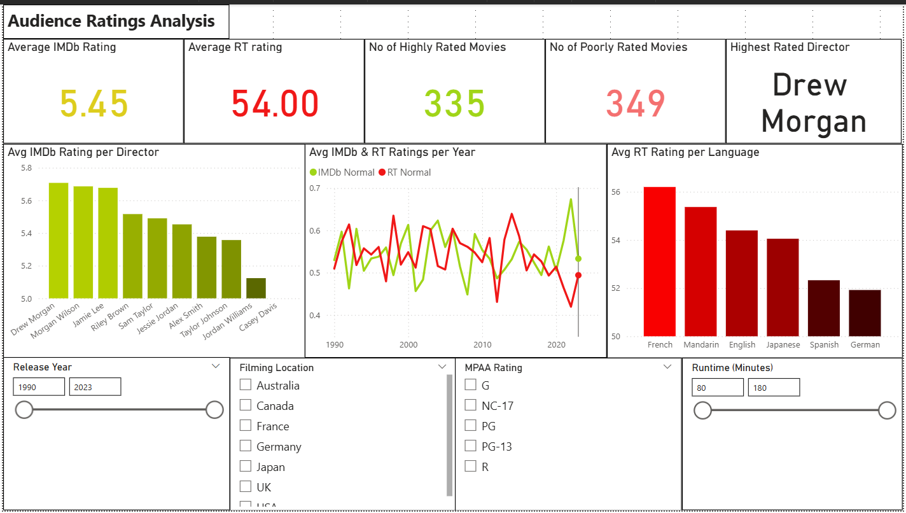

# 🎬 Movie Industry Analytics Dashboard (Power BI)

This project presents an end-to-end **Power BI analytics solution** built to analyze movie industry data and uncover patterns in **revenue drivers, genre performance, audience behavior, and trend-setting content**.  
The dashboard is designed to support **data-driven decision making** for production planning and marketing strategy.

---

## 🖼️ Dashboard Preview

Screenshots of key dashboard pages are available in the `Screenshots/` folder.

> Note: Interactive features are best experienced directly in Power BI Desktop.

There are 3 dashboards in this file, they are as follows:
1. Financial Dashboard

2. Audience Ratings Dashboard

3. Genre Analysis Dashboard

---

## 📌 Project Objective

To analyze historical movie data and identify:
- What drives profitability in the movie industry
- Which genres and ratings perform best
- How audience perception impacts financial outcomes
- What characteristics define trend-setting films

---

## 📊 Dashboards Included

This Power BI report contains **three main dashboards**:

### 1️⃣ Financial Analysis Dashboard
- Total budget, worldwide gross, profit, average profit per movie, and ROI
- ROI comparison across filming locations
- Budget vs gross trends over time
- Revenue contribution by filming location
- Interactive filters for year, rating, language, director, and location

### 2️⃣ Audience Ratings Dashboard
- Average IMDb and Rotten Tomatoes ratings
- Count of highly rated vs poorly rated movies
- Highest rated director
- Rating trends over time
- Rating comparison by language and director

### 3️⃣ Genre Analysis Dashboard
- Most and least common genres
- Highest and lowest rated genres
- Most and least profitable genres
- Genre-wise profit distribution
- Genre share by revenue

---

## 🗂️ About the Data

- **Dataset size**: 1,000 movies  
- **Time period**: 1990 – 2023  
- **Key fields**:
  - Budget, Domestic Revenue, Worldwide Revenue
  - IMDb & Rotten Tomatoes ratings
  - Genres, Directors, Languages
  - Filming Locations, Release Year
  - Extracted themes from movie synopsis

---

## 🛠️ Data Preprocessing & Modeling

- Cleaned missing values and corrected data types
- Created calculated columns:
  - Profit
  - ROI
  - Rating Bucket
  - Trendsetter Label
- Built DAX measures for key KPIs:
  - Average ROI
  - Profitability Score
  - Rating Score
- Extracted themes using rule-based text processing
- Designed a **star-schema data model** for efficient reporting

---

## 🔍 Key Insights & Takeaways

1. **Genre Performance**  
   Thrillers and Documentaries show **15–20% higher profitability scores** compared to other genres.

2. **Trendsetter Impact**  
   Only **21% of movies** qualify as trendsetters, yet they contribute **45–50% of total profit**.

3. **Ratings vs ROI**  
   Movies with **IMDb ratings ≥ 7** generate **~30% higher ROI** on average.

4. **Budget Optimization**  
   **Mid-range budgets ($50–100M)** consistently deliver the best ROI, outperforming high-budget blockbusters.

5. **Release Timing Advantage**  
   Movies released between **February and September** earn **$20–30M more on average** than year-end releases.

---

## 📈 Key Results Summary

- **Average ROI across portfolio**: 3.46  
- **Total revenue analyzed**: $232M  
- **Total profit visualized**: $137M  
- **Dashboard scale**: 26 interactive report pages covering:
  - Financials
  - Genre Analysis
  - Audience Ratings
  - Trendsetter Identification
  - Comparative Views

---

## 📥 How to Use

1. Download the `.pbix` file from this repository
2. Open it using **Power BI Desktop**
3. Use slicers and filters to explore insights by:
   - Year
   - Genre
   - Director
   - Language
   - Filming location
   - Runtime and rating

---

## 🧾 Tools Used

- Power BI Desktop
- DAX
- Microsoft Excel
- Python (Numpy & Pandas)
- Google Collab

---
